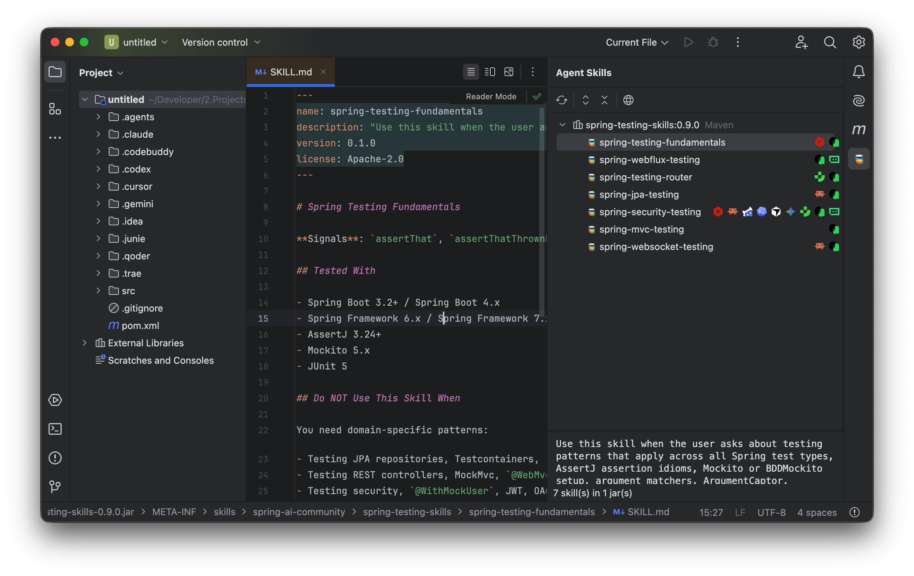

<div align="center">

# SkillsJars Helper


**Manage Agent Skills like any other Maven dependency, right inside your JetBrains IDE.**
**像管理 Maven 依赖一样, 在 JetBrains IDE 内管理 Agent Skills.**

[](https://plugins.jetbrains.com/vendor/9afaba35-91ea-4364-8ced-64db868dd23e)
[](#兼容性)
[](#从源码构建)
[](#开源协议)

[GitHub](https://github.com/dong4j/skillsjars-helper) ·
[SkillsJars](https://www.skillsjars.com/) ·
[作者其他插件](https://plugins.jetbrains.com/vendor/9afaba35-91ea-4364-8ced-64db868dd23e)

</div>

---

## 介绍

**SkillsJars Helper** 是一款面向 JetBrains 系 IDE 的插件, 让以 Maven artifact 形式分发的 **Agent Skills**
（即 [SkillsJars](https://www.skillsjars.com/)）在 IDE 中成为一等公民.

[Agent Skills](https://docs.claude.com/en/docs/agents-and-tools/agent-skills/overview) 是现代 Coding Agent (Claude Code, Codex, Junie,
Cursor, Gemini, Qoder, Trae, CodeBuddy 等) 复用行为的标准载体 —— 一个目录, 包含 `SKILL.md` 和可选的脚本 / 资源. **SkillsJars** 通过 Maven /
Gradle 仓库分发这些 skill, 让团队像管理普通依赖一样版本化和共享.

但 IDE 侧一直缺少配套体验:

- 不知道 classpath 上到底有哪些 skill, 来自哪个 artifact.
- 想看 `SKILL.md` 还要手动解压 JAR.
- 想把 skill 装到 `.claude/skills`、`.codex/skills` 等本地目录时, 还得自己拷贝、重命名、查重.
- 升级、本地修改、同名冲突没有可靠提示.

**SkillsJars Helper 补上这块空白**: 不解压、不离开 IDE, 即可发现、预览和分发这些 skill.

## 主要能力



- **依赖扫描**: 自动扫描 Maven 普通依赖与 `skillsjars-maven-plugin` 的 `<dependencies>`, 识别 JAR 内的 `META-INF/skills/**/SKILL.md` 与
  `META-INF/resources/skills/**/SKILL.md`.
- **Agent Skills 工具窗**: 按 artifact 分组的树形列表, 下方独立描述面板; 支持 SpeedSearch / Tooltip / 双击或 `Enter` 打开 `SKILL.md` / 右键
  Copy Name / Copy Coordinate / Open Source Jar.
- **一键导出到 9 个 Agent 目录**: `.claude/skills`, `.codex/skills`, `.junie/skills`, `.agents/skills`, `.cursor/skills`, `.gemini/skills`,
  `.qoder/skills`, `.trae/skills`, `.codebuddy/skills`, 或自定义目录.
- **导出 Manifest**: 每个导出目录写入 `.skillsjars-helper.json`, 记录来源 artifact 与每个文件的 `sha256`, 自动判断**升级 / 本地修改 / 同名冲突
  **, 不需要重型索引.
- **安装状态徽标**: skill 叶子节点右对齐显示已安装到的 Agent 品牌图标, 鼠标悬浮即可看到具体 agent id.
- **开放扩展点**: 三方插件实现 `SkillSourceScanner` 即可接入 Gradle / SBT 或自有构建系统, 无需修改本插件协调层.

## 安装

### 方式一: JetBrains Marketplace（推荐）

1. 打开 IntelliJ IDEA / 其他 JetBrains IDE.
2. `Settings` → `Plugins` → `Marketplace`, 搜索 **SkillsJars Helper**.
3. 点击 `Install`, 重启 IDE.

### 方式二: 从 GitHub Release 下载

1. 在 [Releases](https://github.com/dong4j/skillsjars-helper/releases) 页面下载 `skillsjars-helper-<version>.zip`.
2. `Settings` → `Plugins` → 齿轮图标 → `Install Plugin from Disk...`, 选中下载的 zip.

## 使用

### 1. 给项目添加 SkillsJar

像普通 Maven 依赖一样添加:

```xml
<dependency>
    <groupId>com.example</groupId>
    <artifactId>your-skillsjar</artifactId>
    <version>1.0.0</version>
</dependency>
```

或者放在 `skillsjars-maven-plugin` 的 `<dependencies>` 下（按 SkillsJars 推荐用法）:

```xml
<plugin>
    <groupId>com.skillsjars</groupId>
    <artifactId>skillsjars-maven-plugin</artifactId>
    <version>...</version>
    <dependencies>
        <dependency>
            <groupId>com.example</groupId>
            <artifactId>your-skillsjar</artifactId>
            <version>1.0.0</version>
        </dependency>
    </dependencies>
</plugin>
```

### 2. 打开 Agent Skills 工具窗

在 IDE 右侧工具栏点击 **Agent Skills**, 即可看到按 artifact 分组的 skill 列表.

- **双击** skill / 按 `Enter`：直接打开 JAR 内的 `SKILL.md`, 无需解压.
- **右键 skill**: Copy Name / Copy Coordinate / Open Source Jar.

### 3. 导出 skill 到 Agent 目录

- **右键 skill** → `Extract to ▸ <Agent>`：导出到指定 Agent 的本地目录.
- **右键 artifact** → `Extract all skills to ▸ <Agent>`：批量导出整个 JAR 内的 skill.

导出后, skill 叶子节点右侧会出现对应 Agent 的品牌徽标; 重启 IDE 后徽标仍会保留, 因为状态从磁盘 `.skillsjars-helper.json` 重扫得到.

后续再次导出同一个 skill 时, 插件会根据本地状态自动选择行为:

| 状态               | 行为                     |
|------------------|------------------------|
| 已是最新             | 静默跳过, Notification 提示  |
| 有新版本             | 直接写入, Notification 提示  |
| 本地已修改过           | 弹出二次确认（yes/no）         |
| 目录已存在但无 manifest | 弹出二次确认（yes/no）         |
| 同名但来自不同 artifact | 三选项: 覆盖原有 / 改用后缀名 / 取消 |

## 兼容性

| 维度               | 范围                                                                      |
|------------------|-------------------------------------------------------------------------|
| **JetBrains 平台** | IntelliJ IDEA Community / Ultimate **2024.2 – 2025.3**                  |
| **构建工具**         | Maven 普通依赖 + `skillsjars-maven-plugin` 的 `<dependencies>`; Gradle 支持在路上 |
| **运行环境**         | 与 IDE 自带 JBR 一致（Java 21 编译, 21 运行）                                      |

> 其他基于 IntelliJ Platform 的 IDE (PyCharm, GoLand, WebStorm 等) 在兼容平台版本范围内通常可用, 但官方仅以 IntelliJ IDEA 为测试基线.

## 扩展

`SkillsJars Helper` 的公共契约都在 `dev.dong4j.idea.skillsjars.helper.api` 包内, 三方插件可以直接使用.

### 查询当前项目的 skill

```java
SkillRegistry registry = project.getService(SkillRegistry.class);
List<SkillJarArtifact> artifacts = registry.getArtifacts();
registry.addListener(snapshot -> {
    // 扫描结果更新时回调
});
```

### 编程式导出 skill

```java
SkillExportService exporter = project.getService(SkillExportService.class);
ExportPlan plan = exporter.planExport(descriptor, target);
ExportResult result = exporter.execute(plan);
```

### 接入新的 skill 来源（Gradle / SBT / 自有构建系统）

实现 `SkillSourceScanner` 并通过 `plugin.xml` 注册即可:

```xml
<idea-plugin>
    <depends>dev.dong4j.idea.skillsjars.helper</depends>

    <extensions defaultExtensionNs="dev.dong4j.idea.skillsjars.helper">
        <skillSourceScanner
            implementation="com.example.MyGradleScanner"/>
    </extensions>
</idea-plugin>
```

`SkillSourceScanner` 的实现负责给出 `SkillJarSource` 流, 解析、合并、对外暴露的工作仍然由本插件协调层完成 —— 你只需要关心"在我的构建系统里, 哪些
JAR 可能含 skill".

> 完整 API 与扩展点契约见源码 `src/main/java/dev/dong4j/idea/skillsjars/helper/api/` 与 [`docs/design.md`](docs/design.md).

## 从源码构建

### 环境要求

- JDK **21+**
- 任意支持 Gradle 的 IDE（推荐 IntelliJ IDEA）

### 构建命令

```bash
git clone https://github.com/dong4j/skillsjars-helper.git
cd skillsjars-helper

./gradlew runIde         # 在内嵌沙箱 IDE 中调试本插件
./gradlew test           # 跑单元测试
./gradlew buildPlugin    # 产出 build/distributions/skillsjars-helper-<version>.zip
./gradlew verifyPlugin   # IntelliJ Platform 跨版本兼容性校验
```

构建产物位于 `build/distributions/`, 可直接用于"从磁盘安装插件".

## 贡献

欢迎贡献 issue 与 PR. 在动手之前请快速过一下:

1. **先看 [`AGENTS.md`](AGENTS.md)**：项目地图、包职责、扩展点与已知陷阱都在那里, 能帮你 5 分钟内定位到要改的位置.
2. **完整设计参考 [`docs/design.md`](docs/design.md)**：一/二期完整架构与决策记录.
3. **三期规划见 [`docs/phase3-publish.md`](docs/phase3-publish.md)**：发布前检查 / 打包配置生成 / 发布向导.

### 开发规范

- **代码风格**: Java 21, 允许 `record` / pattern matching; Lombok 仅限 `@Getter / @Builder / @RequiredArgsConstructor / @Slf4j`, 不用
  `@Data`.
- **注释**: 公共类与方法补 Javadoc, 重点解释"为什么"和"关键约束", 而不是重复代码本身.
- **国际化**: 面向用户的字符串走 `SkillsJarsHelperBundle.message("...")`, 中英 (`*.properties` 与 `*_zh_CN.properties`) 两份都要补.
- **公共 API 兼容**: 修改 `api/` 包下的接口和 model 需要在 [`includes/pluginChanges.html`](includes/pluginChanges.html) 写一行变更说明.
- **测试**: 新功能尽量补单元测试; 改了 `sinceBuild` 或平台 API 必须本地跑一次 `./gradlew verifyPlugin`.

### 提交流程

1. Fork 本仓库, 在自己的分支上开发.
2. 提交前确认 `./gradlew test` 通过.
3. PR 中描述清楚: **为什么需要这个改动** / **怎么验证**. UI 相关改动建议附截图.
4. PR 标题建议带前缀: `feat:` / `fix:` / `refactor:` / `docs:` / `test:` / `chore:`.

### 报告问题

在 [GitHub Issues](https://github.com/dong4j/skillsjars-helper/issues) 提交时请附上:

- IDE 版本（`Help` → `About`）
- 插件版本
- 复现步骤
- 必要时附 `Help` → `Show Log in Finder/Explorer` 中的相关日志片段

## 路线图

当前已发布版本提供完整的**发现 → 预览 → 导出**闭环. 后续规划:

- **Gradle 依赖扫描**：通过同一 `SkillSourceScanner` 扩展点接入, 复用现有协调层与 UI.
- **SkillsJar 发布前检查与打包**：校验本地 `skills/` 目录, 生成发布配置, 详见 [`docs/phase3-publish.md`](docs/phase3-publish.md).
- **`allowed-tools` 风险标识**：在工具窗中标注高敏感权限, 仅提示不阻断.
- **SkillsJars.com 市场搜索与一键安装**：在 IDE 内搜索已发布的 SkillsJar 并按项目类型生成依赖片段.

## 开源协议

本项目基于 [MIT License](LICENSE) 开源 —— Copyright © 2026 [dong4j](https://github.com/dong4j).

## 相关链接

- **SkillsJars 官网**: <https://www.skillsjars.com/>
- **Agent Skills 规范**: <https://docs.claude.com/en/docs/agents-and-tools/agent-skills/overview>
- **作者其他 JetBrains 插件**: <https://plugins.jetbrains.com/vendor/9afaba35-91ea-4364-8ced-64db868dd23e>
